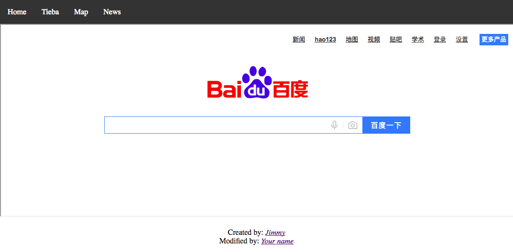

## HTML Homework 4 - Lecture 5
### Motivation
- Use what you learned about HTML `Lists`, `Blocks`, `Classes`, `Iframes` and `FilePath` to create a wrapper web page for Baidu like below
## Due Time
- Due: Jan. 8th 11:00a
### Reference
